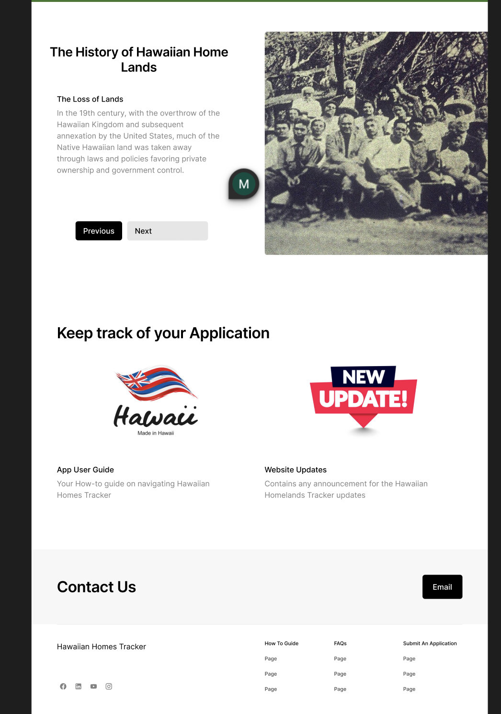
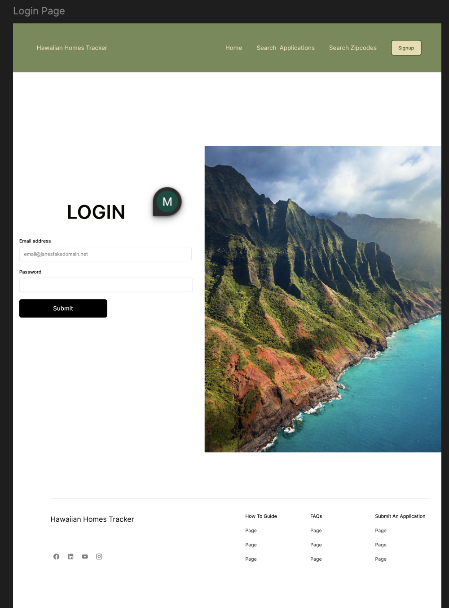

# Hawaiian Homes Tracker    
The Hawaiian Homes Tracker is the first ever independently built backend REST API built to streamline the managements of the Department of Hawaiian Home Lands (DHHL) waitlist for native Hawaiian homestead applications. 
Inspired by the Hawaiian Homes Commision Act, this project addresses the lack of accessible, modern digital tools for tracking and managing waitlist data. Since the DHHL currently provides this data in misaligned, difficult to read and parse PDF tqables, all 40,000+ application records have been manually parse and structured to meet the API's model requirements. 
This app serves to tie with the previously created backend API and serve as the front end of the Hawaiian Homes Tracker web application.

## Live demo link

## Technologies Used
React, Tailwind, Vite, react-router-dom, HTML, CSS, Javascript, lazy-loading, Vitest, Cypress, 

## WIREFRAME
img here

## FEATURES
- **Search**
Enables users to search via last name, ranking, and application dates
- **Lazy Loading**
placeholder
- **CRUD:**
placeholder
- **LOGIN, SIGNUP, SIGNOUT**
placeholder
- **RESOURCES**
placeholder
- **Cultural Enrichment**
placeholder
- **Responsive Design**
placeholder