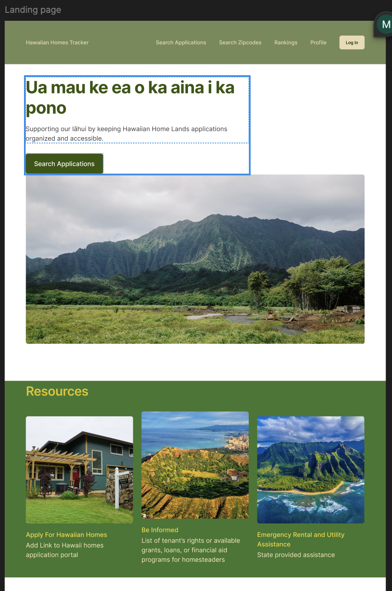

# Hawaiian Homes Tracker    
The Hawaiian Homes Tracker is the first ever independently built backend REST API built to streamline the managements of the Department of Hawaiian Home Lands (DHHL) waitlist for native Hawaiian homestead applications. 
Inspired by the Hawaiian Homes Commision Act, this project addresses the lack of accessible, modern digital tools for tracking and managing waitlist data. Since the DHHL currently provides this data in misaligned, difficult to read and parse PDF tqables, all 40,000+ application records have been manually parse and structured to meet the API's model requirements. 
This app serves to tie with the previously created backend API and serve as the front end of the Hawaiian Homes Tracker web application.

## Live demo link

## Technologies Used
React, Tailwind, Vite, react-router-dom, HTML, CSS, Javascript, lazy-loading, Toastify, formsubmit, axios, tanstack/usequery, Cypress for testing, vercel for deployment

## WIREFRAME
[Link To Figma](https://www.figma.com/design/FHDxiXAG9o5T7hcL21rkSd/Hawaiian-Homes-Tracker-Frontend?node-id=0-1&t=rF6TZyf37axSCEBn-1)

## FEATURES
- **Search**
Enables users to search via last name, ranking, area code and application dates
- **Lazy Loading**
Lazy loads search pages for website optimization and prevent stale data
- **CRUD:**
Securely allows user to create, update, delete, and view all applications created
- **LOGIN, SIGNUP, SIGNOUT**
Using JWT users have the option to signup and perform crud operations upon login from their own dedicated profiles
- **RESOURCES**
Information for homesteaders, legal assistance, loans and more are providded in resources 
- **Cultural Enrichment**
A history of hawaiian homelands is rendered in the home page, along with several native hawaiian grants and health aides available
- **Responsive Design**
Responsive design all through, compatible with most modern cellular devices and computers
- **CONTACT**
Using formsubmit, users are able to send a direct email from the website for any assistance needed from submitting apps to suggesting how to improve the website

## TESTING
A full checklist of what's covered by cypress testing is documented here
[Frontend testing checklist](./frontend-hawaiianhomestracker/cypress/e2e/home.cy.js)

## STRETCH
- **REVAMP FEATURES DESIGN**
- **ADD COMMUNITY BOARD**
- **ADD MINI AI BOT FOR LIVE ASSISTANCE**
